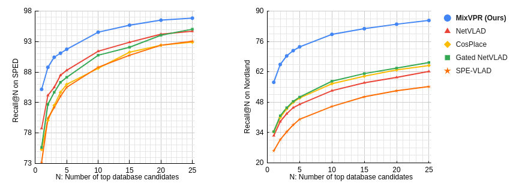

# MixVPR: Feature Mixing for Visual Place Recognition

This is the official repo for WACV 2023 paper: **MixVPR: Feature Mixing for Visual Place Recognition** ([LINK](https://openaccess.thecvf.com/content/WACV2023/html/Ali-bey_MixVPR_Feature_Mixing_for_Visual_Place_Recognition_WACV_2023_paper.html))


## Trained models

GSV-Cities framework (https://github.com/amaralibey/gsv-cities) has been used for training all models in our paper.



## Weights

<table>
<thead>
  <tr>
    <th rowspan="2">Backbone</th>
    <th rowspan="2">Output<br>dimension</th>
    <th colspan="3">Pitts250k-test</th>
    <th colspan="3">Pitts30k-test</th>
    <th colspan="3">MapillarySLS-val</th>
    <th rowspan="2">DOWNLOAD<br></th>
  </tr>
  <tr>
    <th>R@1</th>
    <th>R@5</th>
    <th>R@10</th>
    <th>R@1</th>
    <th>R@5</th>
    <th>R@10</th>
    <th>R@1</th>
    <th>R@5</th>
    <th>R@10</th>
  </tr>
</thead>
<tbody>
  <tr>
    <td>ResNet50</td>
    <td>4096</td>
    <td>94.3</td>
    <td>98.2</td>
    <td>98.9</td>
    <td>91.6</td>
    <td>95.5</td>
    <td>96.4</td>
    <td>88.2</td>
    <td>93.1</td>
    <td>94.3</td>
    <td><a href="https://drive.google.com/file/d/11rxwsx6aUn7CwRyGxvFOWpAmUxniwREN/">LINK</a></td>
  </tr>
</tbody>
</table>

Code to load the pretrained weights is as follows:

```
from main import VPRModel

model = VPRModel(backbone_arch='resnet50', 
                 layers_to_crop=[4],
                 agg_arch='MixVPR',
                 agg_config={'in_channels' : 1024,
                             'in_h' : 20,
                             'in_w' : 20,
                             'out_channels' : 1024,
                             'mix_depth' : 4,
                             'mlp_ratio' : 1,
                             'out_rows' : 4},
                )

state_dict = torch.load('./LOGS/resnet50_MixVPR_4096.ckpt')
model.load_state_dict(state_dict)
model.eval()
```

## Bibtex

```
@inproceedings{ali2023mixvpr,
  title={MixVPR: Feature Mixing for Visual Place Recognition},
  author={Ali-bey, Amar and Chaib-draa, Brahim and Gigu{\`e}re, Philippe},
  booktitle={Proceedings of the IEEE/CVF Winter Conference on Applications of Computer Vision},
  pages={2998--3007},
  year={2023}
}
```
