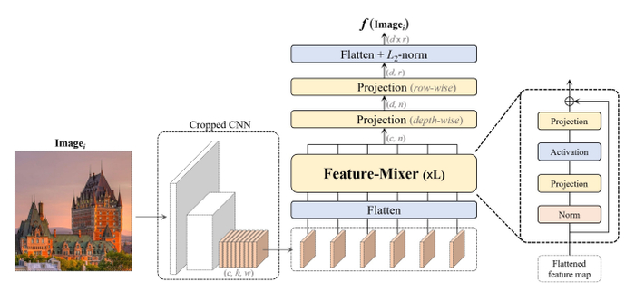
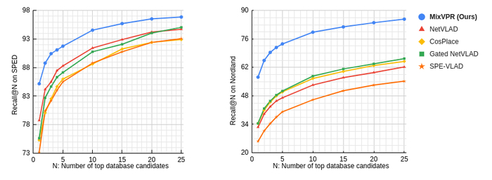

# MixVPR: Feature Mixing for Visual Place Recognition

[](https://paperswithcode.com/sota/visual-place-recognition-on-mapillary-test?p=mixvpr-feature-mixing-for-visual-place)
[](https://paperswithcode.com/sota/visual-place-recognition-on-mapillary-val?p=mixvpr-feature-mixing-for-visual-place)
[](https://paperswithcode.com/sota/visual-place-recognition-on-nordland?p=mixvpr-feature-mixing-for-visual-place)
[](https://paperswithcode.com/sota/visual-place-recognition-on-pittsburgh-250k?p=mixvpr-feature-mixing-for-visual-place)
[](https://paperswithcode.com/sota/visual-place-recognition-on-pittsburgh-30k?p=mixvpr-feature-mixing-for-visual-place)
[](https://paperswithcode.com/sota/visual-place-recognition-on-sped?p=mixvpr-feature-mixing-for-visual-place)

This is the official repo for WACV 2023 paper "**MixVPR: Feature Mixing for Visual Place Recognition"**

### Summary

This paper introduces MixVPR, a novel all-MLP feature aggregation method that addresses the challenges of large-scale Visual Place Recognition, while remaining practical for real-world scenarios with strict latency requirements. The technique leverages feature maps from pre-trained backbones as a set of global features, and integrates a global relationship between them through a cascade of feature mixing, eliminating the need for local or pyramidal aggregation. MixVPR achieves new state-of-the-art performance on multiple large-scale benchmarks, while being significantly
more efficient in terms of latency and parameter count compared to existing methods.

[[WACV ](https://openaccess.thecvf.com/content/WACV2023/html/Ali-bey_MixVPR_Feature_Mixing_for_Visual_Place_Recognition_WACV_2023_paper.html)[open access](https://openaccess.thecvf.com/menu)] [[ArXiv](https://arxiv.org/abs/2303.02190)]



## Trained models

All models have been trained on GSV-Cities dataset (https://github.com/amaralibey/gsv-cities).



### Weights

<table>
<thead>
  <tr>
    <th rowspan="2">Backbone</th>
    <th rowspan="2">Output<br>dimension</th>
    <th colspan="3">Pitts250k-test</th>
    <th colspan="3">Pitts30k-test</th>
    <th colspan="3">MSLS-val</th>
    <th rowspan="2">DOWNLOAD<br></th>
  </tr>
  <tr>
    <th>R@1</th>
    <th>R@5</th>
    <th>R@10</th>
    <th>R@1</th>
    <th>R@5</th>
    <th>R@10</th>
    <th>R@1</th>
    <th>R@5</th>
    <th>R@10</th>
  </tr>
</thead>
<tbody>
  <tr>
    <td>ResNet50</td>
    <td>4096</td>
    <td>94.3</td>
    <td>98.2</td>
    <td>98.9</td>
    <td>91.6</td>
    <td>95.5</td>
    <td>96.4</td>
    <td>88.2</td>
    <td>93.1</td>
    <td>94.3</td>
    <td><a href="https://drive.google.com/file/d/1vuz3PvnR7vxnDDLQrdHJaOA04SQrtk5L/view?usp=share_link">LINK</a></td>
  </tr>
 <tr>
    <td>ResNet50</td>
    <td>512</td>
    <td>93.2</td>
    <td>97.9</td>
    <td>98.6</td>
    <td>90.7</td>
    <td>95.5</td>
    <td>96.3</td>
    <td>84.1</td>
    <td>91.8</td>
    <td>93.7</td>
    <td><a href="https://drive.google.com/file/d/1khiTUNzZhfV2UUupZoIsPIbsMRBYVDqj/view?usp=share_link">LINK</a></td>
  </tr>
<tr>
    <td>ResNet50</td>
    <td>128</td>
    <td>88.7</td>
    <td>95.8</td>
    <td>97.4</td>
    <td>87.8</td>
    <td>94.3</td>
    <td>95.7</td>
    <td>78.5</td>
    <td>88.2</td>
    <td>90.4</td>
    <td><a href="https://drive.google.com/file/d/1DQnefjk1hVICOEYPwE4-CZAZOvi1NSJz/view?usp=share_link">LINK</a></td>
  </tr>
</tbody>
</table>

Code to load the pretrained weights is as follows:

```
from main import VPRModel

# Note that images must be resized to 320x320
model = VPRModel(backbone_arch='resnet50', 
                 layers_to_crop=[4],
                 agg_arch='MixVPR',
                 agg_config={'in_channels' : 1024,
                             'in_h' : 20,
                             'in_w' : 20,
                             'out_channels' : 1024,
                             'mix_depth' : 4,
                             'mlp_ratio' : 1,
                             'out_rows' : 4},
                )

state_dict = torch.load('./LOGS/resnet50_MixVPR_4096_channels(1024)_rows(4).ckpt')
model.load_state_dict(state_dict)
model.eval()
```

## Bibtex

```
@inproceedings{ali2023mixvpr,
  title={MixVPR: Feature Mixing for Visual Place Recognition},
  author={Ali-bey, Amar and Chaib-draa, Brahim and Gigu{\`e}re, Philippe},
  booktitle={Proceedings of the IEEE/CVF Winter Conference on Applications of Computer Vision},
  pages={2998--3007},
  year={2023}
}
```
